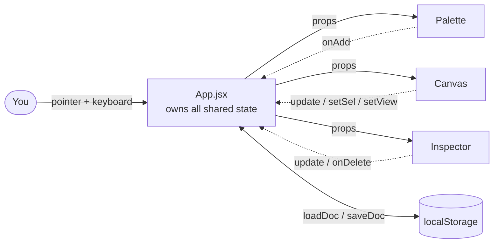
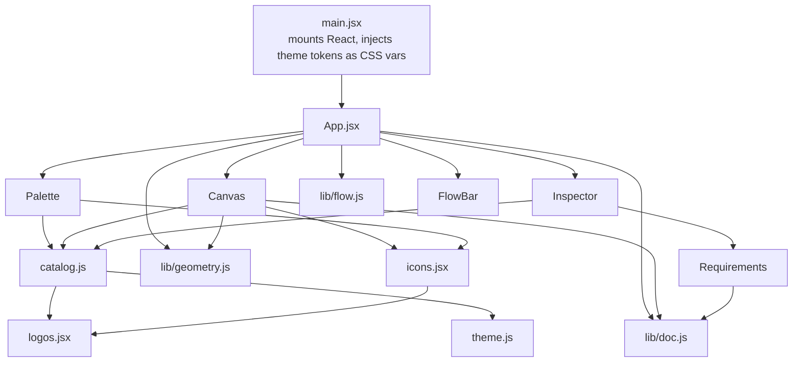
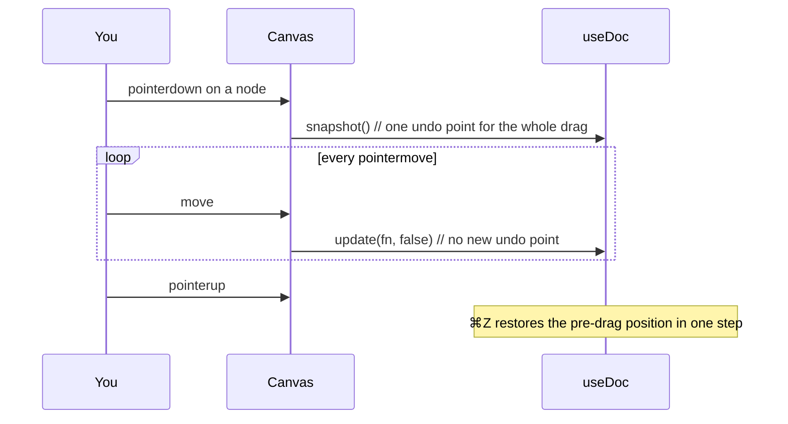
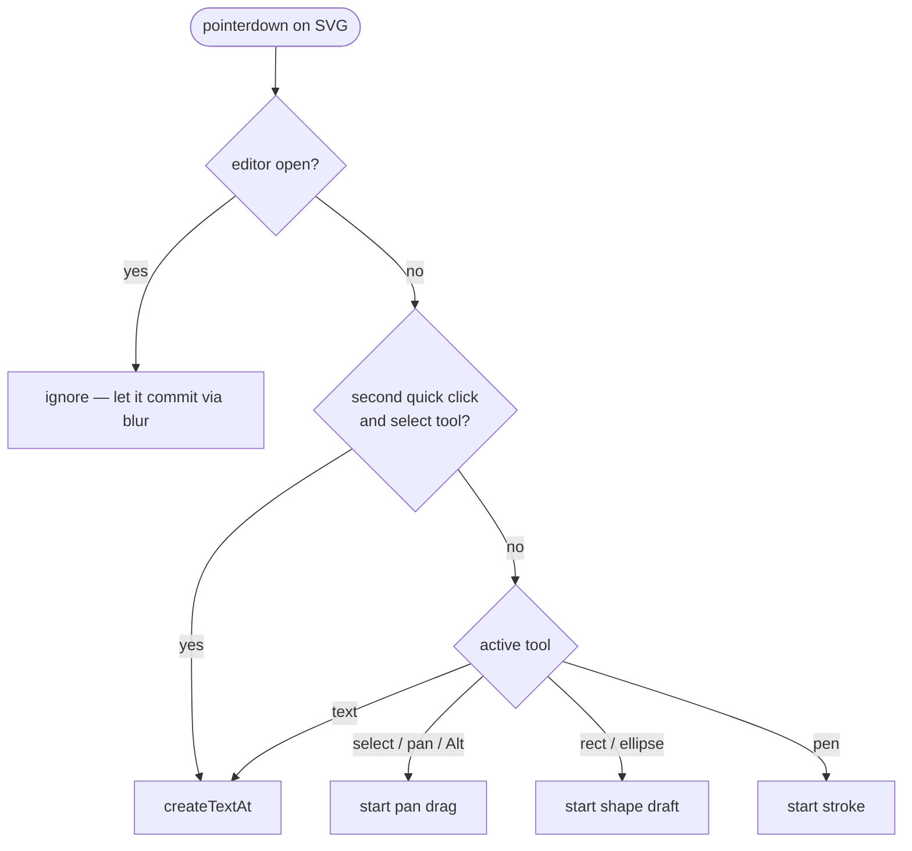

# Architecture

How System Design Studio is put together, and why it's shaped this way.

The whole app is one React tree over one plain JavaScript object. There is no backend, no
router, no state library, and no component framework. Understanding three things —
**the document**, **who owns which state**, and **the two coordinate systems** — is
enough to find your way around every file.

---

## 1. The shape of the thing

It's a single-page app. Vite builds it to static files; GitHub Pages serves them. Nothing
runs on a server, so every feature is either a pure function over the document or a
browser API call.



The dotted arrows are the only way children change anything: they call functions passed
down as props. No child holds shared state, and nothing talks sideways.

---

## 2. Module map

Dependencies point one direction — UI depends on data and helpers, never the reverse.



| File | Responsibility |
| --- | --- |
| `main.jsx` | Mounts the root. Copies `theme.js` tokens onto `:root` as CSS custom properties so plain CSS can use them. Imports the two self-hosted fonts. |
| `App.jsx` | Owns all shared state. Toolbar, keyboard shortcuts, autosave. |
| `ui/Palette.jsx` | Left panel. Searchable component picker. |
| `ui/Canvas.jsx` | The SVG surface and every pointer gesture on it. The largest file, and the only one with real interaction logic. |
| `ui/Inspector.jsx` | Right panel. Properties for the current selection, or the design brief. |
| `ui/Requirements.jsx` | Collapsible FR/NFR checklists, rendered inside the Inspector. |
| `ui/FlowBar.jsx` | Transport controls for the request walkthrough. |
| `lib/flow.js` | Turns the diagram into an ordered list of hops, and drives playback. |
| `catalog.js` | The component library: 38 concepts + 27 brands, and `TYPE_INDEX` for lookup by type. |
| `icons.jsx` / `logos.jsx` | SVG marks. `<Icon>` resolves a type to either a brand logo or a generic icon. |
| `theme.js` | Design tokens. Single source of truth for colour, shared by the SVG canvas and the CSS chrome. |
| `lib/doc.js` | The document model: shape, persistence, and the undo stack. |
| `lib/geometry.js` | Pure maths. No React, no DOM. |

`lib/` is deliberately free of React except for `useDoc`, and free of the DOM entirely.
That's what made it testable in isolation.

---

## 3. The document

One object holds everything the user has made. Every list is an array of items with an
`id`.

```js
{
  title: "",       // design brief
  brief: "",
  fr:      [],     // { id, text, done }  functional requirements
  nfr:     [],     // { id, text, done }  non-functional requirements
  nodes:   [],     // { id, type, x, y, w, h, label, color }
  edges:   [],     // { id, from, to, label, color, dashed, directed }
  texts:   [],     // { id, x, y, text, size, color }
  shapes:  [],     // { id, kind: "rect"|"ellipse", x, y, w, h, color, dashed, label }
  drawings:[],     // { id, points: [[x,y], …], color, width }
  notes:   [],     // vestigial — nothing reads or writes this
}
```

### The `${kind}s` convention

This is the one naming trick worth internalising. A selection is `{ kind, id }`, and
**pluralising `kind` gives the document key**. That single rule is why so much code is
generic instead of a switch statement:

```js
const listKey = `${kind}s`;              // "node" -> "nodes", "shape" -> "shapes"
const item = doc[listKey].find((x) => x.id === id);
```

`Inspector`'s `patch()` and `App`'s `deleteSelection()` both work for every item type
because of it. The cost is that `kind` must stay a word whose plural is `+s` — a `kind`
of `"entity"` would silently look for `doc.entitys`.

---

## 4. Who owns what

All shared state lives in `App`. Everything else is local and disposable.

| State | Lives in | Why there |
| --- | --- | --- |
| `doc` | `App` via `useDoc` | Three panels read it; the Canvas and Inspector both write it. |
| `view` `{x, y, k}` | `App` | Pan/zoom. The HUD buttons change it, the Canvas changes it, and both must agree. |
| `tool` | `App` | The toolbar sets it, the Canvas and the CSS cursor read it. |
| `sel` `{kind, id}` | `App` | Set by the Canvas, read by the Inspector. This is the link between the two panels. |
| `snap` / `curved` / `directed` | `App` | Toolbar toggles that change how the Canvas behaves. |
| `svgRef` | `App` | Created here because `zoomToFit` and `addNode` need the canvas box too. |
| `drag`, `pending`, `editing`, `draft`, `lastDown` | `Canvas` | Mid-gesture bookkeeping. Nothing outside a gesture cares, so it never goes up. |
| `query` | `Palette` | Search text. Purely local. |
| `open`, per-list `draft` | `Requirements` | Drawer open state and the un-submitted input. |

The rule the codebase follows: **state goes up only when two siblings need it.** `sel`
goes up because the Inspector needs what the Canvas selected. `drag` stays down because
only the Canvas cares that a pointer is currently held.

---

## 5. How a change flows

Every mutation goes through `update()` from `useDoc`.

```js
update(fn, commit = true)
```

- `fn` receives the current doc and returns a **partial** — just the keys that change.
- `commit: true` takes an undo snapshot first. Use for one-shot actions.
- `commit: false` skips the snapshot. Use for continuous changes.

That second argument is what makes undo feel right. Dragging a node fires `update` on
every pointer move; if each one snapshotted, a single drag would cost you fifty presses
of ⌘Z. Instead the gesture calls `snapshot()` **once** on pointer-down, then updates with
`commit: false` for the rest:



The same pattern applies to typing: each keystroke is `commit: false`, so undo steps back
to before the whole edit rather than character by character.

`useDoc` keeps `past` and `future` in refs rather than state, and mirrors their lengths
into a small `depth` state so the undo/redo buttons can disable themselves.

---

## 6. Two coordinate systems

This is the part that trips people up. There are two spaces and you must always know
which one a number is in.

- **Screen space** — `clientX/clientY` from a pointer event. Pixels in the viewport.
- **World space** — where things actually live in the document. `node.x`, `node.y` are world.

The link between them is `view = { x, y, k }`, applied as one SVG transform on the root
group:

```jsx
<g transform={`translate(${view.x},${view.y}) scale(${view.k})`}>
```

Everything inside that group is drawn in world coordinates and the browser does the
mapping. Converting the other way is `toWorld()`:

```js
world.x = (event.clientX - svgRect.left - view.x) / view.k
```

**The exception worth knowing:** the text editor is a real HTML `<textarea>`, not an SVG
element, so it sits *outside* the transform and has to do the mapping itself — world →
screen, the inverse of the above:

```js
left = text.x * view.k + view.x
```

Zooming with the wheel keeps the point under the cursor fixed by adjusting `x`/`y` to
compensate for the scale change, rather than just changing `k`.

---

## 7. The canvas render stack

Order in the JSX is z-order in SVG — later siblings paint on top. The stack is chosen so
the things you most need to click are the easiest to hit:

| Layer | Why it's here |
| --- | --- |
| Background `<rect>` | Full-bleed black. Also the hit target for "click empty canvas". |
| Shapes | Grouping boxes belong behind their contents. |
| Drawings | Freehand annotation. |
| Edges | Above shapes so connections stay visible over a group box. |
| Nodes | The primary objects. |
| Texts | Labels should never be hidden. |
| Draft | The in-progress rectangle/ellipse/stroke being dragged out. |
| *(outside the SVG)* Text editor | An HTML `<textarea>` positioned over everything. |

Two hit-testing details that look odd but are deliberate:

- **Edges** render an invisible `stroke="transparent"` path at `strokeWidth={14}` under
  the visible one. A 2px line is nearly impossible to click.
- **Shapes** do the same around their outline, and keep `fill="none"`. The border is the
  handle; the interior stays transparent to clicks so you can still select whatever you
  drew inside the box.

---

## 8. Input handling, and why it looks strange

`Canvas` sets pointer capture on `pointerdown` so a drag keeps tracking even when the
cursor leaves the element. That is standard, and it has one consequence that shapes the
rest of the input code:

> **Pointer capture retargets the browser's compatibility mouse events.** `click` and
> `dblclick` get delivered to the capture element rather than to whatever is under the
> cursor.

So `onDoubleClick` on the background rect never fired. Rather than fight it, the canvas
recognises the gesture itself — two `pointerdown`s close in time and space:

```js
function isDoubleClick(e) {
  const prev = lastDown.current;
  const quick = e.timeStamp - prev.t < 400 && Math.hypot(e.clientX - prev.x, e.clientY - prev.y) < 6;
  lastDown.current = { t: quick ? 0 : e.timeStamp, x: e.clientX, y: e.clientY };
  return quick;
}
```

That moved text creation earlier in the gesture, which exposed a second problem: the
`mouseup`/`click` still to come would move focus off the freshly-created editor, firing
`onBlur`, which discarded the still-empty text. The editor appeared and vanished within a
frame. Two guards fix it:

1. **Focus on the next animation frame**, not synchronously — so the rest of the gesture
   dispatches first.
2. **Ignore a blur that arrives before the editor ever held focus.** A `hasFocus` ref is
   set by `onFocus`; `stopEditing()` returns early if it's still false.

An earlier attempt used a 250 ms grace window instead, which also swallowed genuine fast
commits. Keying off actual focus state is the version that survives.

### Gesture dispatch

`onBackgroundDown` is the single entry point for pointer-downs that reach the SVG. Node,
shape, text, edge and drawing handlers all call `stopPropagation()`, so reaching the
background handler *means* you hit empty canvas.



Connecting is a two-click state machine: `pending` holds the first endpoint, and the
node whose id matches renders with a dashed accent outline so you can see what's armed.
`tryConnect(id)` is shared by nodes and shapes — **any box can be an endpoint**, which is
why edges resolve through one merged lookup:

```js
const boxById = Object.fromEntries([...doc.nodes, ...doc.shapes].map((o) => [o.id, o]));
```

Edges whose endpoint no longer exists render as `null` rather than throwing, and
`deleteSelection()` prunes them when a node or shape is removed.

---

## 9. Persistence

`saveDoc` runs in an effect keyed on `doc`, so every change writes to `localStorage`.
Both read and write are wrapped in `try/catch` — private-mode and quota failures degrade
to "no autosave" rather than crashing.

`normalizeDoc()` is the reason saved documents survive schema changes. It fills in missing
arrays and coerces types, so a document written before `shapes` or `directed` existed
still loads. Related: edges read `directed === false` rather than `!directed`, so an old
edge with no `directed` field stays directed instead of silently losing its arrowhead.

There is no server. Documents are per-browser and per-device.

---

## 10. Build and deploy

```
npm run dev      # vite dev server with HMR
npm run build    # static output to dist/
```

`vite.config.js` sets `base: "./"`, so asset URLs are relative and the same build works
under `/<repo>/` on Pages, on a custom domain, or from `file://`.

Pushing to `main` triggers `.github/workflows/deploy.yml`, which builds and publishes via
GitHub's first-party Pages actions using OIDC — no deploy branch, no tokens.

---

## 11. Decisions worth knowing

## 12. The request walkthrough

Pressing **Flow** replays a request travelling through the design. It is derived
entirely from the diagram — there is nothing extra to author and nothing stored in the
document.

`buildFlow(doc)` turns the graph into an ordered list of hops:

- **Entry point** is a box nothing else points at — the client edge of the system.
  Falls back to the first drawn edge when everything sits in a cycle.
- **Breadth-first** from there, so the walkthrough follows the request outward: client
  first, then what it reaches, then the tier behind that.
- **Undirected edges are traversable both ways**; directed ones only forward.
- Each edge is walked once. Disconnected clusters are appended in drawing order so
  nothing silently vanishes from the run.

Each hop is `{ edgeId, from, to }`, where `from`/`to` are the **direction of travel** —
not necessarily the direction the edge was drawn, since an undirected edge can be crossed
either way.

### One number drives playback

`useFlow` keeps a single float `pos` in `[0, hops.length]`:

```
pos = 2.4   ->   hop index 2, 40% of the way across it
```

The integer part is the current hop, the fraction is progress along it. Stepping,
scrubbing and playing all write to the same number, so they can't disagree — which is
the failure mode you get from keeping `index` and `progress` as separate state.

A `requestAnimationFrame` loop advances `pos` by `dt / HOP_MS * speed`. The loop reads
from a ref rather than state so it never depends on a stale closure, and it stops
scheduling itself at the end rather than spinning.

### Drawing the request

`pointOnEdge(geo, t)` in `geometry.js` evaluates the position along an edge — a lerp for
straight ones, the cubic Bézier for curved. That is why `edgeGeometry` now returns its
control points `c1`/`c2`: they were computed already and only used for the `d` string.
Evaluating the curve directly avoids measuring the rendered path with
`getPointAtLength()` on every frame.

While a run is active the canvas re-reads three things per frame:

| What | How |
| --- | --- |
| Which edge is lit | everything but the current `edgeId` drops to 15% opacity |
| How full a component is | `fillOf(id)` — the entry point starts full; anything already reached is full; the current destination fills as the token crosses toward it |
| Where the request is | `pointOnEdge` at the hop's progress |

`fillOf` is what makes a database *look* like it received something: the colour wash
deepens, and stores and caches additionally fill from the bottom like a vessel, clipped
to the node's rounded rectangle. Which components do that is data-driven — anything whose
`TYPE_INDEX` category is `Data Stores` or `Caching`.

---

## 13. Decisions worth knowing

**SVG, not Canvas 2D.** Every element stays in the DOM, so hit-testing, hover cursors and
accessibility come free. The cost is that a very large diagram means a very large DOM;
Canvas 2D would scale further but you'd hand-roll all picking.

**No state library.** One document object and one `useDoc` hook is less machinery than
Redux or Zustand would be here, and undo/redo is easier when history is just an array of
whole documents. The tradeoff is that every change re-renders the whole tree — fine at
this size, and the thing that would need attention first if diagrams got large.

**Theme tokens in JS, mirrored to CSS.** `theme.js` is the single source; `main.jsx`
copies it onto `:root`. SVG attributes need JS values, CSS needs custom properties, and
this way they can't drift.

**`<Icon>` prefers brand logos.** For a shared key, `LOGOS` wins over `ICON`. That's why
the catalog is kept free of type collisions — a concept sharing a key with a brand would
be silently unreachable. Three generic icons (`ICON.redis`, `ICON.kafka`,
`ICON.zookeeper`) are shadowed this way and now unreferenced.

**No `<StrictMode>`.** `useDoc` mutates its history refs from inside a `setState` updater.
StrictMode double-invokes updaters in development, which would push each action onto the
undo stack twice. Moving those ref writes out of the updater would let it go back on.
